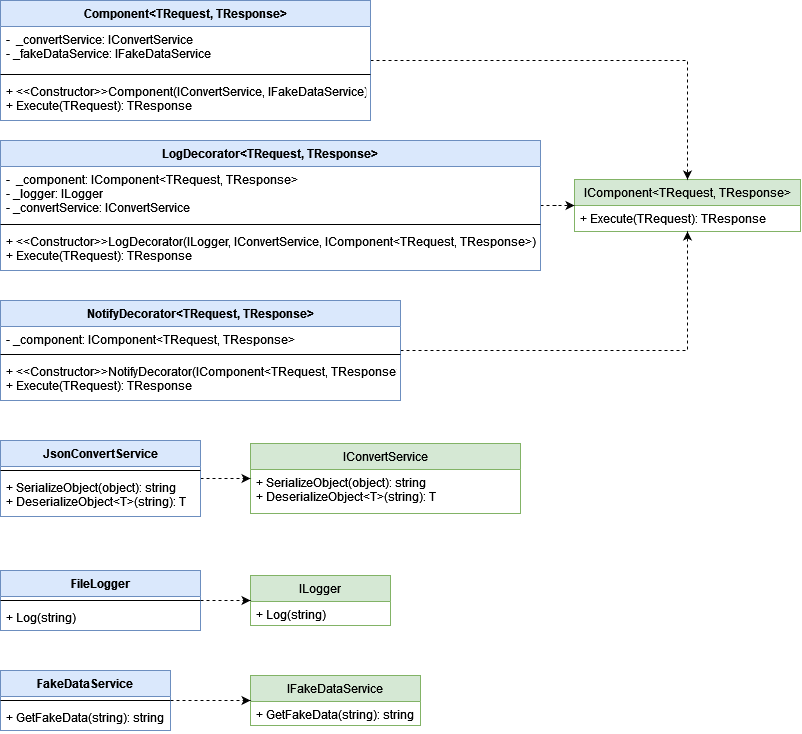

# DI_GenericInterface
It's a scenario that describe issue of Dependency Injection Container when use Generic Interface.

本情境描述一個在使用依賴注入容器時, 抽象為泛型介面會遇到的問題。

## Real-world case

My Application will use other Service. The Service is a Web Api Application that contain only one route, but I can use multiple features via the route. For example, if I post request with JSON Data, and the service will response different content and different format according to the received data.

應用程式將會使用到一個外部服務, 這個服務只有一個路由, 但透過這個路由可以使用到多種功能, 舉例而言, 如果我 post request 到該服務, 則該服務會根據收到的資料來 response 不同的內容及不同的格式。

One feature corresponds to a request's format and a response's format. Suppose there are two feature in the case, and them be provide by FakeDataService Class.

一個功能對應到一個 request 格式及一個 response 格式, 假設在本案例中有兩個功能, 並且這兩項功能是由 FakeDataService 類別提供。

I hope log response and create a notice when application recive response. To do that, I implement Decorator Pattern. In the application Component Class be use to send request and recive response, and it dependant JsonConvertService Class to Serialize and Deserialize. LogDecorator Class be use to log response, and it dependant JsonConvertService Class to Serialize and Deserialize. In addition, LogDecorator Class also dependant FileLogger Class to Write data to text file. NotifyDecorator Class just be use to make noise as a notice.

我希望在接收到 response 之後可以記錄 log 並發出通知, 為了達成這個目的, 我實作了 Decorator Pattern。在這個應用程式中, Component 類別用於發送 request 與接收 response, 並且它依賴 JsonConvertService 進行序列化與反序列化。LogDecorator 類別則用來記錄 response, 它依賴 JsonConvertService 進行序列化與反序列化, 同時依賴 FileLogger 進行實體檔案的寫入。NotifyDecorator 類別用來發出聲音作為通知。

Because only Caller know request's format and a response's format, so I let they be used as GenericType. Autofac support register a decorator for Generic Interface. But how to do this with Microsoft's Dependency Injection Container?

因為只有呼叫端知道 request 的格式及 response 的格式, 所以我讓他們作為泛型被使用。Autofac 支援註冊泛型介面的裝飾器。但要如才能用微軟的依賴注入容器做到一樣的事情?

## Class Diagram



## Manual Inject Instances Demo

Demo without any Dependency Injection Container.

手動注入 Instances, 不使用任何依賴注入容器。

**ProjectName: DI_DecoratorPatternWithGenericInterface**

**FileName: Program.cs**

```csharp
static private void ManualInjectInstancesDemo()
{
    // Request001/Response001 or Request002/Response002
    // Manually inject instances
    IComponent<Request001, Response001> component =
        new NotifyDecorator<Request001, Response001>(
            new LogDecorator<Request001, Response001>(
                new FileLogger(), new JsonConvertService(),
                new Component<Request001, Response001>(new JsonConvertService(), new FakeDataService())));

    var data = new Request001
    {
        APICode = "001",
        DateTime = DateTime.Now,
        Guid = Guid.NewGuid()
    };

    component.Execute(data);
}
```


## Autofac Inject Instances Demo

Demo with Autodac.

使用 Autofac 進行注入。

**ProjectName: DI_DecoratorPatternWithGenericInterface**

**FileName: Program.cs**

```csharp
static private void AutofacInjectInstancesDemo()
{
    // Request001/Response001 or Request002/Response002
    // Autofac inject instances
    var builder = new ContainerBuilder();
    builder.RegisterType<JsonConvertService>().As<IConvertService>();
    builder.RegisterType<FileLogger>().As<ILogger>();
    builder.RegisterType<FakeDataService>().As<IFakeDataService>();

    builder.RegisterGeneric(typeof(Component<,>)).As(typeof(IComponent<,>));
    builder.RegisterGenericDecorator(typeof(LogDecorator<,>), typeof(IComponent<,>));
    builder.RegisterGenericDecorator(typeof(NotifyDecorator<,>), typeof(IComponent<,>));

    IContainer container = builder.Build();
    IComponent<Request001, Response001>  component = container.Resolve<IComponent<Request001, Response001>>();

    var data = new Request001
    {
        APICode = "001",
        DateTime = DateTime.Now,
        Guid = Guid.NewGuid()
    };
    component.Execute(data);
}
```

## Non-Generic Example

If this interface is a non-generic interface, we can achieve the goal with Scrutor plugin.

如果是使用非泛型的介面, 我們可以透過 Scrutor 套件完成這個目標。

**reference: [Scrutor](https://www.nuget.org/packages/Scrutor)**

**ProjectName: DI_Scrutor**

**FileName: Program.cs**

```csharp
static void Main(string[] args)
{
    IServiceCollection sc = new ServiceCollection();
    sc.AddScoped<IComponent, Component>();
    sc.Decorate<IComponent, LogDecorator>();
    sc.Decorate<IComponent, NotifyDecorator>();

    IServiceProvider sp = sc.BuildServiceProvider();

    IComponent compoent = sp.GetService<IComponent>();
    compoent.Execute();
}
```


## Issue

- In the case, not only use Decorator Parttern but also use Generic Interface. Decorator Parttern let the Class have recursive feature. GenericType let the Class have dynamic feature.

- How to let Microsoft's DI Container inject instance of Component Class in LogDecorator's constructor, and inject instance of LogDecorator Class in NotifyDecorator's constructor?

- How to let Microsoft's DI Container know GenericType is Request001/Response001 or Request002/Response002?

- 在本案例中, 除了使用 Decorator Parttern 之外, 同時也使用了泛型介面,  Decorator Parttern 讓類別具備遞迴的特性, 泛型則讓類別具備動態的性質。

- 如何讓微軟的 DI 容器在 LogDecorator 建構式中注入 Component 類別的instance, 並在 NotifyDecorator 建構式中注入 LogDecorator 類別的 instance ?

- 如何讓微軟的 DI 容器知道泛型是 Request001/Response001 或是 Request002/Response002 ?